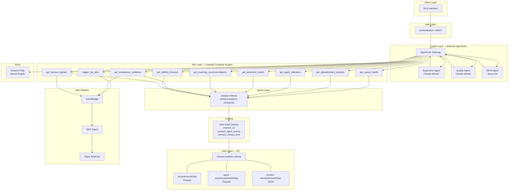
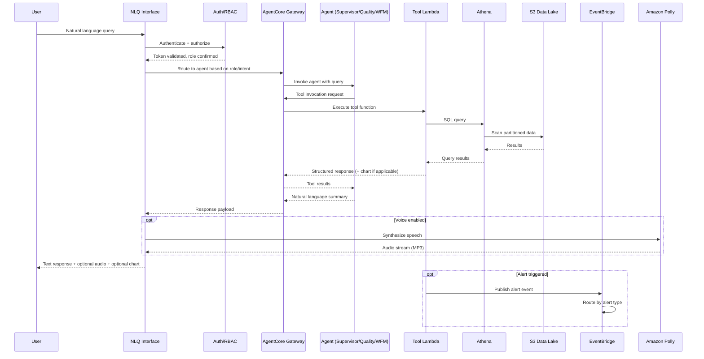
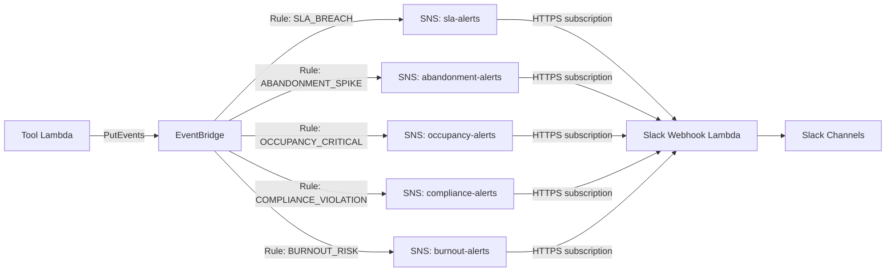

# Design Document: Connect Analytics Platform

## Overview

The Connect Analytics Platform is a serverless, AI-powered analytics system for Amazon Connect contact centers. Three specialized agents — Supervisor, Quality, and WFM — each run on Amazon Bedrock AgentCore and serve distinct personas (floor supervisors, QA/compliance analysts, workforce planners). Users interact via natural language queries; agents translate queries into Athena SQL, execute against a Glue-cataloged data lake in S3, and return summarized insights with optional chart visualizations and voice output.

The system uses a shared AgentCore Gateway that routes tool invocations from all three agents to Lambda container image functions. Alerts flow through EventBridge → SNS → Slack. All infrastructure is defined in AWS CDK (Python).

### Key Architectural Decisions

| Decision | Choice | Rationale |
|---|---|---|
| Agent runtime | Bedrock AgentCore (serverless) — NOT the older Amazon Bedrock Agents | Managed agent orchestration, per active CPU-second billing (I/O wait free), no infra to maintain. Uses `bedrock-agentcore` SDK, not `bedrock-agent`. |
| Tool routing | AgentCore Gateway (managed, shared by all 3 agents) | Routes tool invocations from agents to Lambda. $0.005/1K invocations (~$0.23/mo). Required component — not optional. |
| Supervisor/Quality model | Claude Sonnet | Strong reasoning for root cause analysis and nuanced language understanding |
| WFM model | Nova Lite | Mostly numerical workloads; 40x cheaper than Sonnet |
| Tool execution | Lambda Container Images (DockerImageFunction → ECR) | matplotlib + numpy + faker + pyarrow exceed Lambda's 50MB zip limit; container images support up to 10GB. CDK auto-creates ECR repos and pushes images on `cdk deploy` — zero manual ECR setup. |
| Data generator | Lambda Container Image (triggered once on deploy) | Also exceeds zip limit (faker + pandas + pyarrow). Runs as CDK custom resource on deploy, generates 70K synthetic records to S3. |
| Data format | Parquet (CTR, Agent Events), JSON (Contact Lens) | Parquet for columnar query performance; JSON for semi-structured transcript data |
| IaC | CDK (Python) | Consistent with Lambda Python stack; single language for infra + app |
| Alert delivery | EventBridge → SNS → Slack webhook | Decoupled, filterable, retryable |
| Voice | Nova Sonic on Bedrock | Low-latency conversational speech-to-speech; AWS's newer direction for agentic voice |

### AgentCore vs Amazon Bedrock Agents — Critical Distinction

| | Amazon Bedrock Agents (original) | Amazon Bedrock AgentCore (this project) |
|---|---|---|
| boto3 client | `bedrock-agent` | `bedrock-agentcore` |
| Runtime billing | Per token | Per active CPU-second (I/O wait free) |
| Tool routing | Action Groups + Lambda direct | AgentCore Gateway → Lambda |
| Agent builder | Console wizard | SDK / CDK first-class |
| Model swap | Requires new agent version | Config change only |
| Why it matters | Would cost more at scale | ~30–70% runtime savings + $0.23/mo Gateway |

### Hackathon Scope Cuts (Zero Demo Impact)

| Cut | Why |
|---|---|
| Q in Connect Events (4th stream) | Not referenced in any of the 8 demo queries |
| Named Athena queries in CDK | SQL embedded in Lambda instead — simpler, same result |
| CDK auto-discovery (`Connect:DescribeInstance`) | Demo runs on synthetic data — hardcode S3 path |

Post-hackathon: add these back for production hand-off.

## Architecture

### System Architecture Diagram



### Request Flow




## Components and Interfaces

### 1. NLQ Interface

The entry point for all user interactions. Receives natural language queries, authenticates the user, classifies intent to determine the target agent, and returns responses.

- **Input**: Natural language string + user auth token + optional `voice=true` flag
- **Output**: JSON response with `text`, optional `chart_url` (base64 PNG), optional `audio_url` (MP3 stream)
- **Intent Classification**: The AgentCore Gateway handles routing based on the agent configuration. Each agent has a system prompt scoped to its domain, so misrouted queries get a "not in my scope" response.

### 2. Bedrock AgentCore Agents

Three agents, each configured as a Bedrock AgentCore agent with:
- A system prompt defining its persona and domain
- A set of tools (Lambda functions) registered via the AgentCore Gateway
- A foundation model assignment

| Agent | Model | Tools | Data Sources |
|---|---|---|---|
| Supervisor | Claude Sonnet | `get_queue_health`, `get_abandonment_analysis`, `get_agent_utilization`, `trigger_sla_alert` | CTR, Agent Events |
| Quality | Claude Sonnet | `get_sentiment_trends`, `get_coaching_recommendations`, `get_compliance_violations` | Contact Lens |
| WFM | Nova Lite | `get_staffing_forecast`, `get_burnout_signals` | CTR, Agent Events |

### 3. AgentCore Gateway

A single shared gateway that maps tool names to Lambda function ARNs. All three agents share this gateway. The gateway is a required, billable AgentCore component — it must be created before any agent can call tools.

- **Type**: `LAMBDA` — routes tool calls to Lambda functions
- **Pricing**: $0.005 per 1,000 tool invocations (~$0.23/mo at 1,500 calls/day)
- **Scope**: One gateway per environment, shared by all 3 agents
- **Configuration**: CDK defines the gateway with tool-to-Lambda ARN mappings
- **No custom code** — this is a managed AgentCore component

```python
# AgentCore Gateway creation (via bedrock-agentcore SDK)
gateway = agentcore.create_gateway(
    gatewayName='connect-analytics-gateway',
    gatewayType='LAMBDA',
    lambdaArn='arn:aws:lambda:REGION:ACCOUNT:function:connect-agent-tools',
    roleArn='arn:aws:iam::ACCOUNT:role/AgentCoreGatewayRole'
)
```

### 4. Tool Lambda Functions (Container Images → ECR)

All tools are Python Lambda functions packaged as Docker container images. Container images are required because dependencies (matplotlib, numpy, pyarrow) exceed Lambda's 50MB zip deployment limit. CDK handles the entire container lifecycle automatically:

1. `DockerImageCode.fromImageAsset('./lambda/tools')` in CDK
2. CDK runs `docker build` locally during `cdk deploy`
3. CDK auto-creates an ECR repository
4. CDK tags and pushes the image to ECR
5. Lambda references the ECR image — same Lambda billing, same invocation model, no VPC, no ECS

**Two container images in the project:**

| Image | Path | Dependencies | Purpose |
|---|---|---|---|
| Tool Handler | `lambda/tools/` | boto3, matplotlib, numpy | All 9 agent tools (Athena queries + chart generation) |
| Data Generator | `lambda/generator/` | boto3, faker, numpy, pandas, pyarrow | Synthetic data generation (runs once on deploy) |

**Tool Handler Dockerfile:**
```dockerfile
FROM public.ecr.aws/lambda/python:3.11
COPY requirements.txt ${LAMBDA_TASK_ROOT}/
RUN pip install -r requirements.txt --target "${LAMBDA_TASK_ROOT}"
COPY tools.py ${LAMBDA_TASK_ROOT}/
CMD ["tools.handler"]
```

**Data Generator Dockerfile:**
```dockerfile
FROM public.ecr.aws/lambda/python:3.11
COPY requirements.txt ${LAMBDA_TASK_ROOT}/
RUN pip install -r requirements.txt --target "${LAMBDA_TASK_ROOT}"
COPY generator.py ${LAMBDA_TASK_ROOT}/
CMD ["generator.handler"]
```

**CDK construct (both use DockerImageFunction):**
```python
tool_lambda = lambda_.DockerImageFunction(self, 'ToolHandler',
    code=lambda_.DockerImageCode.from_image_asset('./lambda/tools'),
    environment={'BUCKET': bucket_name, 'WORKGROUP': 'connect-analytics'},
    timeout=Duration.seconds(30),
    memory_size=512,
)

synth_gen = lambda_.DockerImageFunction(self, 'SyntheticDataGen',
    code=lambda_.DockerImageCode.from_image_asset('./lambda/generator'),
    environment={'BUCKET': bucket_name, 'CTR_COUNT': '10000',
                 'AGENT_EVENTS_COUNT': '50000', 'CONTACT_LENS_COUNT': '10000'},
    timeout=Duration.minutes(5),
    memory_size=1024,  # pandas + pyarrow need headroom
)
```

#### Supervisor Tools

**`get_queue_health`**
- **Input**: `{ queue_name?: string, time_range?: string }`
- **Output**: `{ queue_name, queue_size, longest_wait_seconds, service_level_pct, avg_handle_time }`
- **Query**: Athena SQL against `connect_ctr` + `connect_agent_events`

**`get_abandonment_analysis`**
- **Input**: `{ queue_name?: string, time_range?: string }`
- **Output**: `{ abandonment_rate, peak_abandonment_hour, avg_wait_before_abandon, total_abandoned }`
- **Query**: Athena SQL against `connect_ctr`

**`get_agent_utilization`**
- **Input**: `{ agent_id?: string, time_range?: string }`
- **Output**: `{ agents: [{ agent_id, occupancy_rate, current_status, avg_handle_time, contacts_handled }] }`
- **Query**: Athena SQL against `connect_agent_events`

**`trigger_sla_alert`**
- **Input**: `{ queue_name, current_sla_pct, threshold_pct, breach_timestamp }`
- **Output**: `{ alert_id, status: "published" }`
- **Action**: Publishes `SLA_BREACH` event to EventBridge

#### Quality Tools

**`get_sentiment_trends`**
- **Input**: `{ time_range?: string, agent_id?: string }`
- **Output**: `{ periods: [{ date, positive_pct, negative_pct, neutral_pct, mixed_pct }], chart: base64_png }`
- **Query**: Athena SQL against `connect_contact_lens`
- **Chart**: matplotlib line chart of sentiment over time

**`get_coaching_recommendations`**
- **Input**: `{ agent_id?: string, time_range?: string }`
- **Output**: `{ recommendations: [{ agent_id, negative_sentiment_rate, sample_excerpts, coaching_suggestions }] }`
- **Query**: Athena SQL against `connect_contact_lens`

**`get_compliance_violations`**
- **Input**: `{ time_range?: string, violation_type?: string }`
- **Output**: `{ violations: [{ violation_type, contact_id, agent_id, timestamp, transcript_excerpt }] }`
- **Query**: Athena SQL against `connect_contact_lens`
- **Side effect**: If severity=HIGH, publishes `COMPLIANCE_VIOLATION` event to EventBridge

#### WFM Tools

**`get_staffing_forecast`**
- **Input**: `{ forecast_horizon_days: int, queue_name?: string }`
- **Output**: `{ forecast: [{ date, hour, predicted_volume, current_staff, recommended_staff, confidence_lower, confidence_upper }], chart: base64_png }`
- **Query**: Athena SQL against `connect_ctr`
- **Chart**: matplotlib area chart with confidence bands

**`get_burnout_signals`**
- **Input**: `{ threshold?: float, time_range?: string }`
- **Output**: `{ at_risk_agents: [{ agent_id, burnout_score, occupancy_rate, avg_acw_duration, handle_time_trend, recommended_action }] }`
- **Query**: Athena SQL against `connect_agent_events`
- **Side effect**: If burnout_score > critical threshold, publishes `BURNOUT_RISK` event to EventBridge

### 5. Alert Pipeline



- **Event schema**: `{ detail-type: "<ALERT_TYPE>", source: "connect-analytics", detail: { ...alert_payload } }`
- **EventBridge rules**: One rule per alert type, matching on `detail-type`
- **SNS topics**: One per alert type, enabling per-type Slack channel routing
- **Slack formatter**: A lightweight Lambda subscribed to all SNS topics that formats the alert into a Slack Block Kit message and POSTs to the configured webhook URL
- **Retry**: SNS built-in retry (3 attempts, exponential backoff). Failures logged to CloudWatch.

### 6. Voice Integration — Nova Sonic on Bedrock

Nova Sonic is Amazon's low-latency conversational speech-to-speech model on Bedrock — the newer direction AWS is pushing for agentic voice use cases. It replaces the earlier Polly-based approach.

- Invoked optionally when the user requests voice output (`voice=true`)
- Uses Nova Sonic via Bedrock `InvokeModel` API for speech synthesis
- Supports low-latency conversational speech-to-speech — ideal for agentic interactions
- Called after the agent produces a text response
- Returns audio stream alongside the text response
- Target latency: < 3 seconds for synthesis (faster than Polly neural)
- Graceful degradation: if Nova Sonic fails, return text-only response

### 7. Synthetic Data Generator (Lambda Container Image)

A Lambda container image function that generates demo data, triggered once on deploy via a CDK custom resource. Uses faker + pandas + pyarrow — exceeds Lambda zip limit, hence container packaging.

- **10,000 CTR records** — Parquet, partitioned by year/month/day
- **50,000 Agent Event records** — Parquet, partitioned by year/month/day
- **10,000 Contact Lens records** — JSON, partitioned by year/month/day
- Uses `faker` + `numpy` + `pandas` for realistic distributions
- Embeds specific demo patterns (SLA breaches at 2pm, negative sentiment spikes on Mondays, burnout signals for 3 specific agents)
- Deterministic seed for reproducible output
- Runs once on `cdk deploy` via CDK custom resource trigger — not a recurring job

**Why patterns matter:** "Agent-017 had 4 negative calls", "2 agents went to break simultaneously", "Agent-023 occupancy 92% for 8 days" — these come from data, not from the agent prompt. Shape the data to match the demo script.

## Data Models

### S3 Bucket Structure

```
connect-analytics-demo/
├── ctr/
│   └── year=2024/month=01/day=15/
│       └── *.parquet
├── agent-events/
│   └── year=2024/month=01/day=15/
│       └── *.parquet
└── contact-lens/
    └── year=2024/month=01/day=15/
        └── *.json
```

### Glue Data Catalog Tables

#### `connect_ctr` (Parquet)

| Column | Type | Description |
|---|---|---|
| contact_id | string | Unique contact identifier |
| queue_name | string | Queue the contact was routed to |
| agent_id | string | Agent who handled the contact |
| initiation_timestamp | timestamp | When the contact was initiated |
| connected_timestamp | timestamp | When the agent connected |
| disconnect_timestamp | timestamp | When the contact ended |
| queue_duration_seconds | int | Time spent in queue |
| handle_time_seconds | int | Total handle time |
| outcome | string | CONNECTED, ABANDONED, TRANSFERRED |
| service_level_met | boolean | Whether SLA target was met |
| year | string | Partition key |
| month | string | Partition key |
| day | string | Partition key |

#### `connect_agent_events` (Parquet)

| Column | Type | Description |
|---|---|---|
| event_id | string | Unique event identifier |
| agent_id | string | Agent identifier |
| agent_name | string | Agent display name |
| event_type | string | STATE_CHANGE, HEART_BEAT |
| current_state | string | AVAILABLE, ON_CALL, AFTER_CONTACT_WORK, OFFLINE |
| state_start_timestamp | timestamp | When this state began |
| state_duration_seconds | int | Duration in current state |
| contacts_handled_today | int | Running count for the shift |
| occupancy_rate | float | Current occupancy (0.0–1.0) |
| year | string | Partition key |
| month | string | Partition key |
| day | string | Partition key |

#### `connect_contact_lens` (JSON)

| Field | Type | Description |
|---|---|---|
| contact_id | string | Matches CTR contact_id |
| agent_id | string | Agent who handled the contact |
| overall_sentiment | string | POSITIVE, NEGATIVE, NEUTRAL, MIXED |
| customer_sentiment_score | float | -5.0 to 5.0 |
| agent_sentiment_score | float | -5.0 to 5.0 |
| categories | list[string] | Contact Lens categories detected |
| transcript_excerpt | string | Key portion of the transcript |
| compliance_flags | list[string] | Detected compliance issues (e.g., MISSING_DISCLOSURE, PCI_VIOLATION) |
| analysis_timestamp | timestamp | When Contact Lens processed this |
| year | string | Partition key |
| month | string | Partition key |
| day | string | Partition key |

### Alert Event Schema (EventBridge)

```json
{
  "source": "connect-analytics",
  "detail-type": "SLA_BREACH | ABANDONMENT_SPIKE | OCCUPANCY_CRITICAL | COMPLIANCE_VIOLATION | BURNOUT_RISK",
  "detail": {
    "alert_id": "uuid",
    "alert_type": "SLA_BREACH",
    "timestamp": "ISO-8601",
    "severity": "HIGH | MEDIUM | LOW",
    "payload": {
      // Type-specific fields
    }
  }
}
```

#### SLA_BREACH payload
```json
{
  "queue_name": "Sales",
  "current_sla_pct": 62.5,
  "threshold_pct": 80.0,
  "breach_duration_seconds": 300
}
```

#### COMPLIANCE_VIOLATION payload
```json
{
  "violation_type": "MISSING_DISCLOSURE",
  "contact_id": "contact-123",
  "agent_id": "agent-456",
  "transcript_excerpt": "..."
}
```

#### BURNOUT_RISK payload
```json
{
  "agent_id": "agent-789",
  "burnout_score": 0.87,
  "occupancy_rate": 0.95,
  "consecutive_high_occupancy_shifts": 5,
  "recommended_action": "Schedule relief shift within 48 hours"
}
```

### CDK Stack Structure

```
connect-analytics-cdk/
├── app.py                          # CDK app entry point
├── cdk.json                        # CDK config
├── requirements.txt                # CDK + boto3 deps
├── lambda/
│   ├── tools/                      # Tool handler container image
│   │   ├── Dockerfile
│   │   ├── requirements.txt        # boto3, matplotlib, numpy
│   │   └── tools.py                # All 9 tools dispatched by tool_name
│   └── generator/                  # Synthetic data generator container image
│       ├── Dockerfile
│       ├── requirements.txt        # boto3, faker, numpy, pandas, pyarrow
│       └── generator.py            # Generates 70K records to S3
└── stacks/
    ├── data_stack.py               # S3 bucket, Glue DB/tables, Athena workgroup, synthetic data gen Lambda
    ├── agent_stack.py              # AgentCore Gateway, 3 agents, tool handler Lambda (container image → ECR)
    ├── alert_stack.py              # EventBridge rules, SNS topics, Slack webhook Lambda
    └── auth_stack.py               # API key auth (hackathon) or Cognito (production)
```

**CDK Parameters (3 — hackathon deploy):**
```python
instance_id     = CfnParameter(self, 'InstanceId',     type='String')
data_lake_bucket = CfnParameter(self, 'DataLakeBucket', type='String')
alert_dest      = CfnParameter(self, 'AlertDestination', type='String')
```

**What the stack deploys (~8 min):**
1. S3 bucket reference (import existing demo bucket)
2. Glue Database + 3 tables (CTR, Agent Events, Contact Lens)
3. Athena workgroup `connect-analytics` + output location
4. IAM roles (least privilege, scoped to Connect data only)
5. AgentCore Gateway (shared by all 3 agents)
6. Tool handler Lambda container image (1 function, all tools dispatched by tool_name) → auto ECR
7. EventBridge rules (5) + SNS topics (5) → Slack webhook
8. 3x AgentCore agents (Supervisor/Quality → Claude Sonnet, WFM → Nova Lite)
9. CloudWatch Log Group (`/connect-analytics/agents`, 30-day retention)
10. Synthetic data generator Lambda container image → auto ECR (runs once on deploy)

**What you DON'T need:**
| Not needed | Why |
|---|---|
| Manual ECR setup | CDK `DockerImageCode.fromImageAsset()` creates repos and pushes automatically |
| EKS / ECS / Fargate | AgentCore is fully managed — no container orchestration |
| API Gateway | AgentCore Gateway handles tool routing natively |
| LangChain / custom orchestration | AgentCore handles multi-step tool execution |
| Session management code | AgentCore manages session state per sessionId |
| Custom retry logic | AgentCore handles LLM retries and tool failures |

### Configuration Model

SLA thresholds and alert routing are stored as environment variables on the relevant Lambda functions:

```python
# SLA threshold config (per-queue, JSON in env var)
SLA_THRESHOLDS = {
    "Sales": {"target_pct": 80, "window_seconds": 20},
    "Support": {"target_pct": 70, "window_seconds": 30},
    "default": {"target_pct": 80, "window_seconds": 20}
}

# Burnout threshold
BURNOUT_CRITICAL_THRESHOLD = 0.85

# Slack channel routing
ALERT_CHANNEL_MAP = {
    "SLA_BREACH": "#connect-sla-alerts",
    "COMPLIANCE_VIOLATION": "#connect-compliance",
    "BURNOUT_RISK": "#connect-wfm-alerts",
    "ABANDONMENT_SPIKE": "#connect-sla-alerts",
    "OCCUPANCY_CRITICAL": "#connect-sla-alerts"
}
```

## Correctness Properties

*A property is a characteristic or behavior that should hold true across all valid executions of a system — essentially, a formal statement about what the system should do. Properties serve as the bridge between human-readable specifications and machine-verifiable correctness guarantees.*

### Property 1: Query intent routing correctness

*For any* natural language query with a deterministic intent label (supervisor, quality, wfm), the routing function SHALL map it to the corresponding agent identifier. *For any* query that matches no known intent, the routing function SHALL return an "unsupported" classification.

**Validates: Requirements 1.1, 1.4**

### Property 2: Generated SQL references only catalog tables and columns

*For any* SQL string produced by a tool's query builder, every table reference SHALL exist in the set {connect_ctr, connect_agent_events, connect_contact_lens} and every column reference SHALL exist in that table's schema definition.

**Validates: Requirements 1.2**

### Property 3: Error messages never expose raw SQL or stack traces

*For any* Athena error response processed by the error handler, the user-facing message SHALL NOT contain SQL keywords (SELECT, FROM, WHERE, JOIN), table names, or Java/Python stack trace patterns (Traceback, at com., Exception).

**Validates: Requirements 1.5, 8.4**

### Property 4: Queue health response contains all required fields

*For any* valid Athena result set from a queue health query, the `get_queue_health` tool output SHALL contain non-null values for `queue_name`, `queue_size`, `longest_wait_seconds`, and `service_level_pct`.

**Validates: Requirements 2.1**

### Property 5: Agent utilization response contains per-agent metrics

*For any* valid Athena result set from an agent utilization query, the `get_agent_utilization` tool output SHALL contain a list of agents where each entry includes `agent_id`, `occupancy_rate` (0.0–1.0), and `current_status` from the set {AVAILABLE, ON_CALL, AFTER_CONTACT_WORK, OFFLINE}.

**Validates: Requirements 2.2**

### Property 6: Threshold breach triggers alert if and only if metric is below threshold

*For any* metric value and configured threshold pair, the alert-triggering function SHALL publish an EventBridge event if and only if the metric value falls below (for SLA) or exceeds (for burnout) the threshold. This applies uniformly to SLA breach detection, compliance violation severity checks, and burnout score evaluation.

**Validates: Requirements 3.1, 5.3, 7.3**

### Property 7: SLA threshold lookup returns per-queue or default config

*For any* queue name, the threshold lookup function SHALL return the queue-specific threshold if one is configured, or the default threshold otherwise. The returned threshold SHALL always contain `target_pct` and `window_seconds` fields with positive numeric values.

**Validates: Requirements 3.3**

### Property 8: SLA breach alert message contains all required fields

*For any* SLA breach alert payload, the formatted Slack message SHALL contain the queue name, current SLA percentage, configured threshold percentage, and breach timestamp.

**Validates: Requirements 3.4**

### Property 9: Sentiment aggregation percentages sum to 100%

*For any* non-empty set of Contact Lens records within a time range, the aggregated sentiment percentages (positive + negative + neutral + mixed) SHALL sum to 100% (within floating-point tolerance of ±0.01).

**Validates: Requirements 4.1**

### Property 10: Chart generation produces valid output for any non-empty dataset

*For any* non-empty dataset (sentiment trends or staffing forecasts), the chart generation function SHALL produce a non-empty base64-encoded string that decodes to a valid PNG image (starts with PNG magic bytes).

**Validates: Requirements 4.2, 6.2**

### Property 11: Coaching recommendations identify agents above negative sentiment threshold

*For any* set of Contact Lens records, the coaching recommendation function SHALL return exactly those agents whose negative sentiment rate exceeds the configured threshold, and SHALL NOT include agents below the threshold.

**Validates: Requirements 4.3**

### Property 12: Compliance violation detection returns complete violation records

*For any* Contact Lens record with non-empty `compliance_flags`, the violation scanner SHALL return a record containing `violation_type`, `contact_id`, `agent_id`, `timestamp`, and `transcript_excerpt` — all non-null.

**Validates: Requirements 5.1, 5.2**

### Property 13: Staffing forecast structure and confidence interval invariant

*For any* forecast request with horizon N days, the forecast output SHALL contain entries covering the requested horizon, each with non-negative `predicted_volume`, and confidence bounds satisfying `confidence_lower <= predicted_volume <= confidence_upper`.

**Validates: Requirements 6.1, 6.4**

### Property 14: Burnout detection produces valid ranked results

*For any* set of Agent Event records, the burnout detection function SHALL produce scores in the range [0.0, 1.0], the result list SHALL be sorted by `burnout_score` descending, and each entry SHALL contain `agent_id`, `burnout_score`, `occupancy_rate`, `avg_acw_duration`, `handle_time_trend`, and `recommended_action`.

**Validates: Requirements 7.1, 7.2**

### Property 15: Alert routing maps each alert type to the correct SNS topic and Slack channel

*For any* alert event with a valid `detail-type` from {SLA_BREACH, ABANDONMENT_SPIKE, OCCUPANCY_CRITICAL, COMPLIANCE_VIOLATION, BURNOUT_RISK}, the routing function SHALL map it to the SNS topic and Slack channel specified in the channel configuration for that alert type.

**Validates: Requirements 9.1, 9.3**

### Property 16: Slack alert formatter produces valid Block Kit JSON

*For any* alert payload (regardless of alert type), the Slack formatter SHALL produce a JSON object conforming to Slack Block Kit schema with at minimum a `blocks` array containing a header and a section with the alert details.

**Validates: Requirements 9.2**

### Property 17: Slack delivery retry logic

*For any* sequence of Slack webhook failures, the retry handler SHALL attempt exactly 3 retries with exponentially increasing delays, and SHALL log each failure to CloudWatch.

**Validates: Requirements 9.4**

### Property 18: Authentication gate rejects unauthenticated requests

*For any* incoming request, the auth middleware SHALL reject requests without a valid authentication token and return an error response indicating authentication is required. Requests with valid tokens SHALL proceed to authorization.

**Validates: Requirements 12.1, 12.3**

### Property 19: Role-based access control enforcement with audit logging

*For any* (user_role, target_agent) pair, the authorization function SHALL grant access if and only if the role-to-agent mapping permits it (supervisor→Supervisor_Agent, qa_analyst→Quality_Agent, wfm_planner→WFM_Agent). Denied requests SHALL produce an audit log entry containing the user ID, attempted agent, and timestamp.

**Validates: Requirements 12.2, 12.4**

### Property 20: Voice synthesis conditional invocation

*For any* agent response, when `voice=true` is set, the response SHALL include an `audio` field containing a non-empty audio byte stream via Nova Sonic. When `voice=false` or unset, the response SHALL NOT include an `audio` field.

**Validates: Requirements 11.1**

## Error Handling

### Error Categories and Responses

| Category | Source | Handling Strategy | User-Facing Response |
|---|---|---|---|
| Authentication failure | Auth middleware | Reject immediately, return 401 | "Authentication required. Please provide valid credentials." |
| Authorization failure | RBAC check | Reject, log attempt, return 403 | "You do not have access to this agent. Contact your administrator." |
| Intent classification failure | NLQ routing | Return guidance | "I couldn't determine which analytics area your question relates to. Try asking about queue health, sentiment analysis, or staffing forecasts." |
| Athena query failure | Tool Lambda | Catch exception, sanitize, return structured error | "Unable to retrieve data at this time. Please try again or rephrase your query." |
| Athena timeout | Tool Lambda (>30s) | Cancel query, return timeout error | "The query took too long. Try narrowing the time range." |
| Chart generation failure | matplotlib in Lambda | Log error, return text-only response | Agent response without chart, with note: "Chart generation unavailable." |
| EventBridge publish failure | Alert tools | Retry once, log to CloudWatch on failure | Alert not delivered; logged for ops review |
| Slack webhook failure | Slack formatter Lambda | SNS retry (3x exponential backoff), DLQ on exhaustion | Alert queued for retry; CloudWatch alarm on DLQ depth |
| Polly synthesis failure | Voice integration | Log error, return text-only response | Text response delivered without audio |
| Invalid tool input | AgentCore Gateway | Return validation error to agent | Agent rephrases or asks user for clarification |

### Error Sanitization Rules

All error messages returned to users MUST:
1. Not contain SQL statements or fragments
2. Not contain table names, column names, or S3 paths
3. Not contain Python/Java stack traces or exception class names
4. Not contain AWS account IDs, ARNs, or internal resource identifiers
5. Include a correlation ID for support escalation

### Circuit Breaker Pattern

Tool Lambda functions implement a simple circuit breaker for Athena queries:
- **Closed** (normal): Queries execute normally
- **Open** (after 5 consecutive failures in 60s): Return cached "service degraded" response, skip Athena
- **Half-open** (after 30s cooldown): Allow one probe query; if it succeeds, close the circuit

This is implemented via a lightweight in-memory counter in the Lambda execution environment (not a distributed circuit breaker — acceptable for hackathon scope).

## Testing Strategy

### Dual Testing Approach

The platform uses both unit tests and property-based tests for comprehensive coverage:

- **Unit tests** verify specific examples, edge cases, integration points, and error conditions
- **Property-based tests** verify universal properties across randomly generated inputs
- Both are complementary and required

### Property-Based Testing Configuration

- **Library**: [Hypothesis](https://hypothesis.readthedocs.io/) (Python)
- **Minimum iterations**: 100 per property test (via `@settings(max_examples=100)`)
- **Each property test MUST reference its design document property** via a tag comment
- **Tag format**: `# Feature: connect-analytics-platform, Property {number}: {property_text}`
- **Each correctness property is implemented by a SINGLE property-based test**

### Test Organization

```
tests/
├── unit/
│   ├── test_query_routing.py          # Intent classification examples
│   ├── test_queue_health.py           # Queue health tool unit tests
│   ├── test_agent_utilization.py      # Agent utilization tool unit tests
│   ├── test_sentiment_trends.py       # Sentiment aggregation examples
│   ├── test_compliance_violations.py  # Violation detection examples
│   ├── test_staffing_forecast.py      # Forecast output examples
│   ├── test_burnout_signals.py        # Burnout detection examples
│   ├── test_alert_formatter.py        # Slack message formatting examples
│   ├── test_error_handler.py          # Error sanitization examples
│   ├── test_auth.py                   # Auth/RBAC specific scenarios
│   └── test_polly_integration.py      # Voice synthesis examples
├── property/
│   ├── test_routing_properties.py     # Properties 1
│   ├── test_sql_properties.py         # Properties 2, 3
│   ├── test_supervisor_properties.py  # Properties 4, 5, 6 (SLA), 7, 8
│   ├── test_quality_properties.py     # Properties 9, 10 (sentiment), 11, 12
│   ├── test_wfm_properties.py        # Properties 10 (forecast), 13, 14
│   ├── test_alert_properties.py       # Properties 6 (all), 15, 16, 17
│   ├── test_auth_properties.py        # Properties 18, 19
│   └── test_voice_properties.py       # Property 20
└── integration/
    ├── test_athena_queries.py         # Athena query execution against test data
    ├── test_eventbridge_routing.py    # EventBridge rule matching
    └── test_cdk_synth.py             # CDK snapshot tests (Req 10.1–10.4)
```

### Unit Test Focus Areas

- Specific query routing examples (e.g., "How is the Sales queue doing?" → Supervisor Agent)
- Known SLA breach scenarios with exact threshold values
- Sentiment aggregation with hand-calculated expected percentages
- Compliance violation detection with known transcript patterns
- Error sanitization with specific SQL error strings
- RBAC with each (role, agent) combination
- Edge cases: empty result sets, single-record queries, boundary threshold values

### Property Test Focus Areas

Each property test uses Hypothesis strategies to generate:
- Random natural language query intents and agent mappings (Property 1)
- Random SQL strings with table/column references (Property 2)
- Random error messages with embedded SQL/stack traces (Property 3)
- Random Athena result sets for tool response validation (Properties 4, 5)
- Random metric/threshold pairs for alert triggering (Property 6)
- Random queue names for threshold lookup (Property 7)
- Random alert payloads for message formatting (Properties 8, 15, 16)
- Random Contact Lens records for sentiment/compliance (Properties 9, 11, 12)
- Random datasets for chart generation (Property 10)
- Random CTR volume data for forecast validation (Property 13)
- Random Agent Event data for burnout scoring (Property 14)
- Random failure sequences for retry logic (Property 17)
- Random auth tokens and role/agent pairs (Properties 18, 19)
- Random text responses with voice flag (Property 20)

### Integration Test Focus Areas

- CDK snapshot tests verifying all resources are defined (Req 10.1)
- CDK multi-environment synthesis (Req 10.2)
- IAM policy validation — no wildcard actions (Req 10.3)
- CfnOutput presence for endpoints and config (Req 10.4)
- Glue table schema validation against expected formats (Req 8.1)
- Polly neural engine configuration (Req 11.2)
