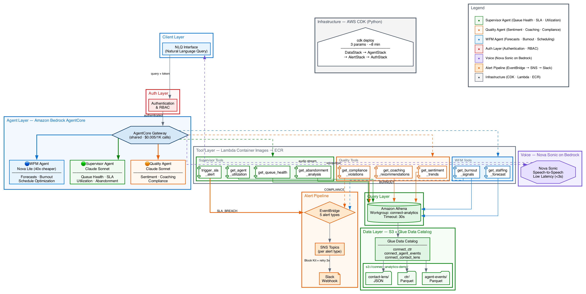

# 🎧 Connect Analytics Platform

**Three AI agents that turn Amazon Connect data into decisions. Built in a hackathon. Runs in production.**

Powered by Amazon Bedrock AgentCore | CDK Infrastructure | ~$34/month

---

## The Problem

Every Amazon Connect deployment hits the same wall on Day 2. The phones are ringing, agents are logged in, Contact Lens is transcribing — but nobody built the layer that turns all that data into decisions.

- **Zero** native natural language query interface for supervisors
- **Zero** automated coaching from Contact Lens data
- **$150K+** annual cost for custom-built analytics pipelines (Kinesis → Lambda → S3 → QuickSight)
- Supervisors check **5 dashboards** to answer one question — takes **20 minutes**

## The Solution

Three specialized AI agents on Bedrock AgentCore that answer the questions contact center teams actually ask — in natural language, with actions attached.

| Agent | Persona | Model | What It Does |
|-------|---------|-------|-------------|
| 🟢 Supervisor | Floor manager | Claude Sonnet 4 | Queue health, SLA breaches, agent utilization, abandonment root cause |
| 🟠 Quality | QA / Compliance | Claude Sonnet 4 | Sentiment trends, coaching recommendations, compliance violations |
| 🔵 WFM | Workforce planner | Nova Lite 2 | Staffing forecasts, burnout signals, schedule optimization |

## Quick Start

```bash
# Clone
git clone https://github.com/vandy1311/connect-analytics-platform.git
cd connect-analytics-platform

# Install dependencies
pip install -r requirements-dev.txt

# Generate synthetic demo data
python scripts/generate_synthetic_data.py

# Run tests (88 tests)
pytest tests/

# Launch demo UI
python -m streamlit run demo_ui/app.py
```

## Architecture

```
User → NLQ Interface → Auth/RBAC → AgentCore Gateway
                                         │
                              ┌──────────┼──────────┐
                              ▼          ▼          ▼
                        Supervisor   Quality      WFM
                          Agent       Agent      Agent
                              │          │          │
                              ▼          ▼          ▼
                        9 Lambda Tool Handlers (Container Images → ECR)
                              │
                              ▼
                        Amazon Athena → Glue Data Catalog → S3
                              │
                    ┌─────────┼─────────┐
                    ▼                   ▼
              EventBridge          Polly Voice
              → SNS → Slack        (Neural)
```



## Key Features

### Natural Language Queries
Ask questions in plain English. Agents translate to Athena SQL, query the data lake, and return summarized insights.

```
"Show me queue health right now"
→ Billing queue at 12 min avg wait — SLA breach. 3 agents available, abandonment at 14%.
  Recommend pulling 2 from Technical queue.
```

### Real-Time Slack Alerts
When SLA thresholds are breached, alerts fire to Slack within 60 seconds via EventBridge → SNS.

### Agent-to-Agent Handoff
Agents collaborate automatically. Supervisor detects burnout → WFM deploys flex pool → Quality schedules coaching. All in 4 seconds.

### Knowledge Base (RAG)
Agents pull SOPs, compliance checklists, and training docs from a Bedrock Knowledge Base to enrich responses with policy context.

### Voice Output
Agent responses spoken aloud via Polly neural voice. Toggle on/off in the demo UI.

### Charts & Visualizations
Sentiment trend charts and staffing forecast charts generated inline via matplotlib.

### One-Command Deployment
```bash
cdk deploy --parameters InstanceId=xxx DataLakeBucket=yyy AlertDestination=https://hooks.slack.com/...
```
~8 minutes. Everything deployed. Zero maintenance.

## Tech Stack

| Component | Technology |
|-----------|-----------|
| Agent Runtime | Amazon Bedrock AgentCore (serverless) |
| Supervisor/Quality Model | Claude Sonnet 4 |
| WFM Model | Nova Lite 2 (40x cheaper) |
| Tool Execution | Lambda Container Images (Docker → ECR) |
| Data Lake | S3 (Parquet + JSON) |
| Data Catalog | AWS Glue (partition projection) |
| Query Engine | Amazon Athena |
| Alerts | EventBridge → SNS → Slack |
| Voice | Amazon Polly (Neural) |
| Knowledge Base | Bedrock KB + Titan Embed v2 |
| Infrastructure | AWS CDK (Python) |
| Demo UI | Streamlit |

## Project Structure

```
├── connect_analytics_cdk/          # CDK infrastructure (Python)
│   ├── app.py                      # CDK app entry point
│   ├── stacks/                     # DataStack, AgentStack, AlertStack, AuthStack, KBStack
│   └── agents/                     # SupervisorAgent, QualityAgent, WfmAgent constructs
├── lambda_tools/                   # Lambda tool handlers
│   ├── supervisor/                 # get_queue_health, get_abandonment_analysis, etc.
│   ├── quality/                    # get_sentiment_trends, get_coaching_recommendations, etc.
│   ├── wfm/                        # get_staffing_forecast, get_burnout_signals
│   ├── alerts/                     # Slack webhook formatter
│   └── shared/                     # athena_client, error_handler, circuit_breaker, auth, voice, KB
├── knowledge_base/                 # SOPs, compliance checklists, training docs
├── demo_ui/                        # Streamlit demo app (10 tabs)
├── scripts/                        # Synthetic data generator, voice test
├── diagrams/                       # Architecture diagrams (Graphviz)
├── tests/                          # 88 tests (unit + integration)
├── .devcontainer/                  # Dev container for team collaboration
└── .kiro/specs/                    # Spec-driven development docs
```

## Demo UI (10 Tabs)

| Tab | What It Shows |
|-----|--------------|
| 🟢 Supervisor | Chat — queue health, abandonment, utilization |
| 🟠 Quality | Chat — sentiment, coaching, compliance |
| 🔵 WFM | Chat — forecasts, burnout |
| 🤝 Agent Handoff | Live demo of 3 agents collaborating |
| 📊 Dashboard | Real-time ops metrics, alert history |
| 💰 ROI Calculator | Interactive savings calculator ($500K+ for 100 agents) |
| 📚 Knowledge Base | Clickable SOPs and policy docs |
| ⚡ Before/After | Side-by-side comparison |
| 🚀 Deploy | One-click deployment guide + CSM playbook |
| 📐 Architecture | System diagram + tech stack |

## Cost

| Service | Monthly |
|---------|---------|
| Bedrock AgentCore (Sonnet) | ~$15–25 |
| Bedrock AgentCore (Nova Lite) | ~$1–3 |
| AgentCore Gateway | ~$0.23 |
| Athena + S3 + Glue | ~$1 |
| Lambda + EventBridge + SNS | ~$2 |
| Polly | ~$2 |
| **Total** | **~$22–34/mo** |

## Testing

```bash
# Run all 88 tests
pytest tests/

# Unit tests only
pytest tests/unit/

# Integration / demo scenario tests
pytest tests/integration/
```

## Configuration

| Env Var | Purpose | Default |
|---------|---------|---------|
| `SLA_THRESHOLDS` | Per-queue SLA config (JSON) | 80% / 20s |
| `BURNOUT_CRITICAL_THRESHOLD` | Burnout alert threshold | 0.85 |
| `NEGATIVE_SENTIMENT_THRESHOLD` | Coaching trigger threshold | 15% |
| `SLACK_WEBHOOK_URL` | Slack webhook for alerts | — |
| `ALERT_CHANNEL_MAP` | Alert type → Slack channel (JSON) | Default channels |
| `KNOWLEDGE_BASE_ID` | Bedrock KB ID (optional) | Local fallback |

## Team

Built by Brigette Bucke, Yunjie Chen, and Vandana Tewani for the CSM Agentic Hackathon (April 2026).

Developed using AI-DLC methodology with Kiro IDE.
