# JWO Prepaid Balance Check - Phase 1 Architecture Diagrams

**Visual Design Documentation**

**Version**: 1.0  
**Date**: March 16, 2026

---

## System Architecture Diagram

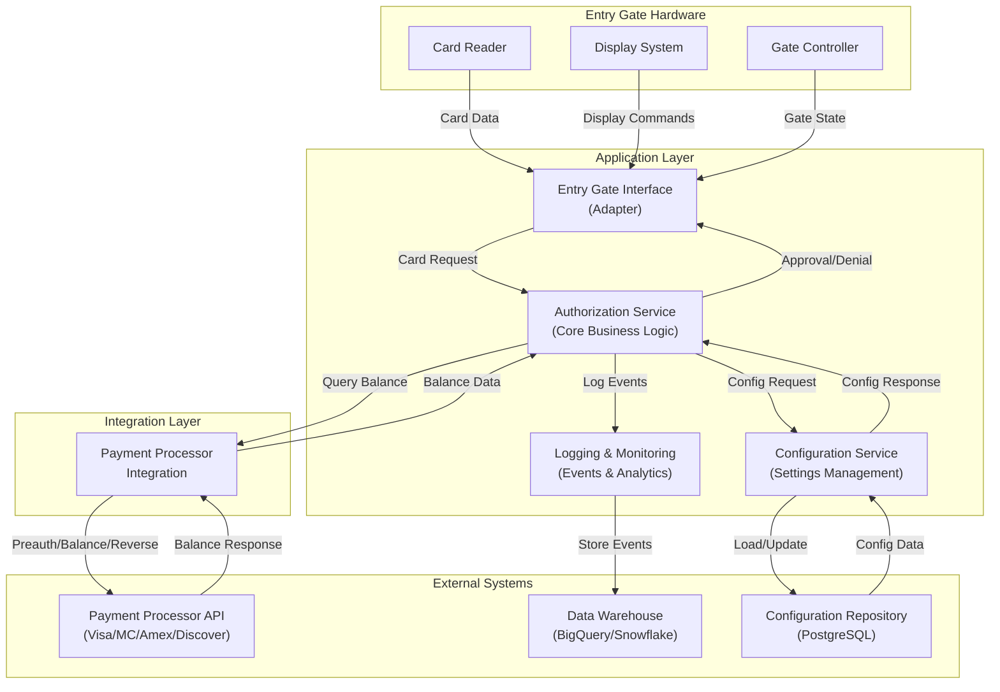

---

## Entry Request Flow (Happy Path)

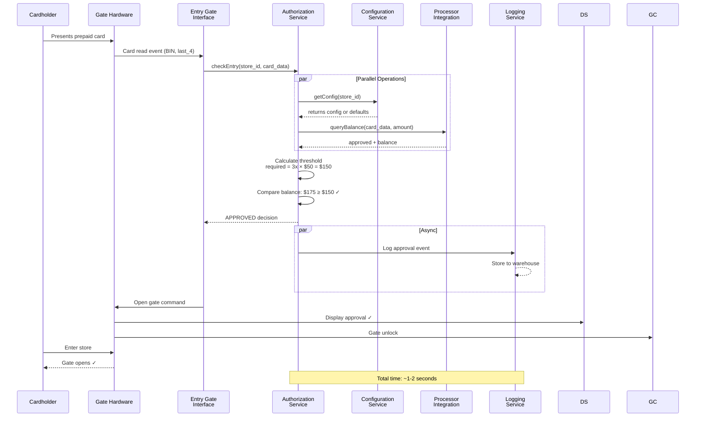

---

## Entry Denial Flow (Insufficient Funds)

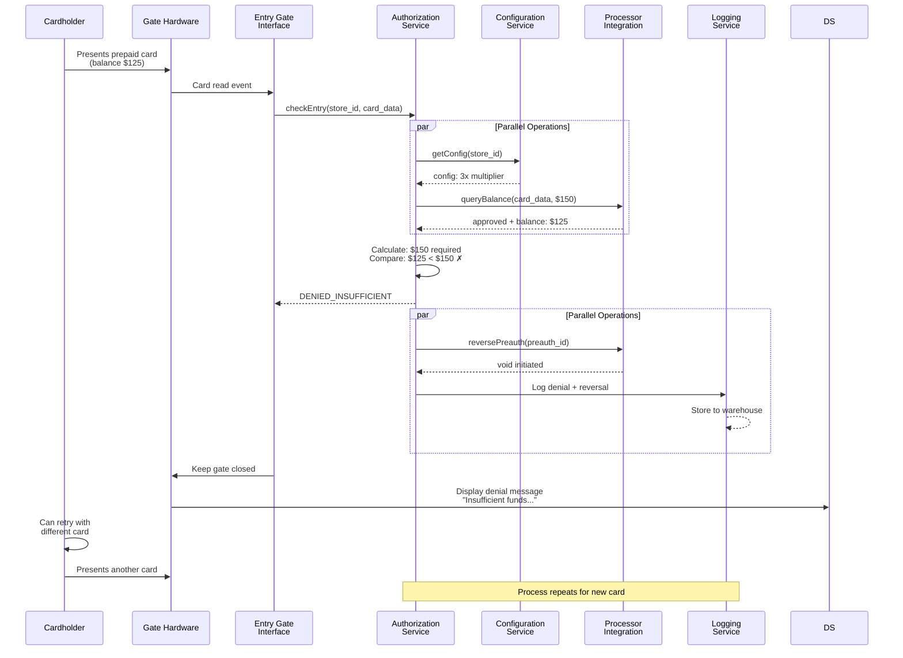

---

## Error Handling: Processor Timeout

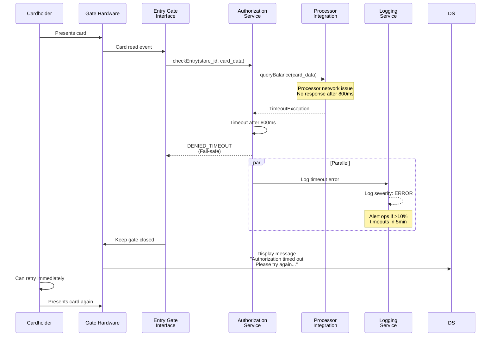

---

## Configuration Missing Handling

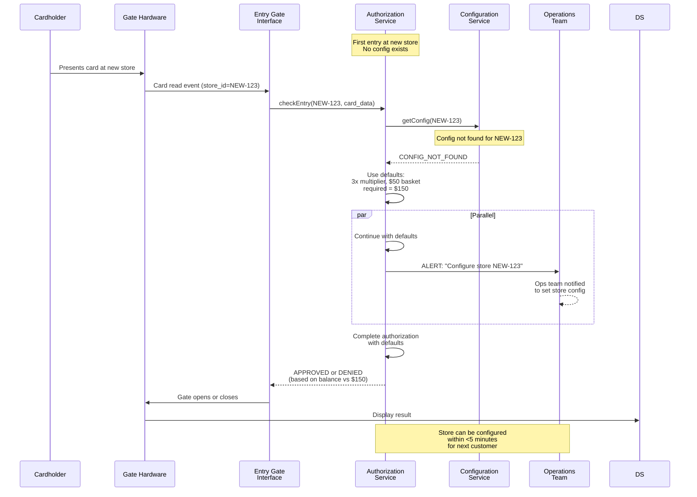

---

## Circuit Breaker State Transitions

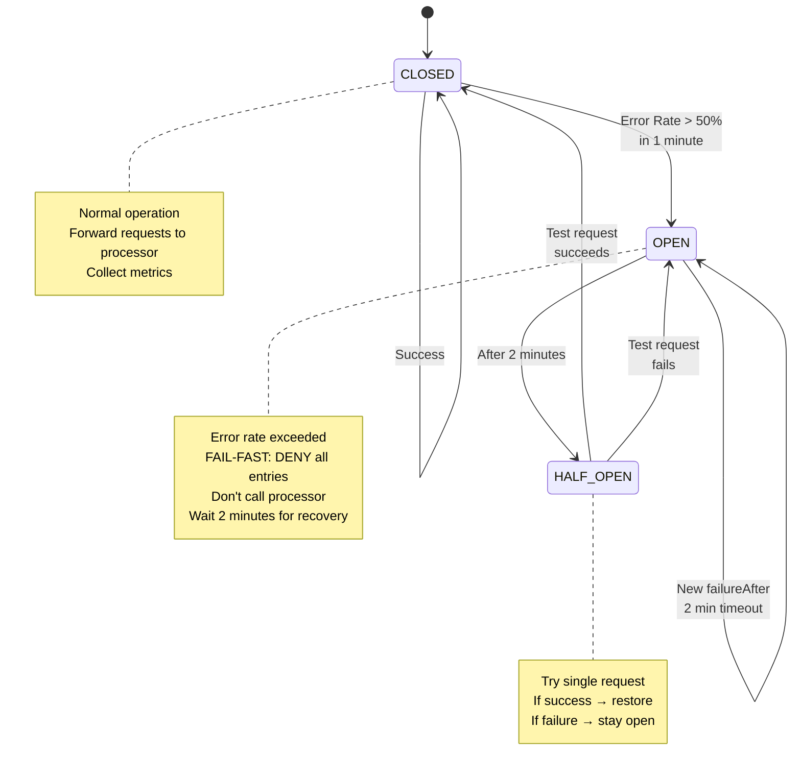

---

## Decision Logic State Machine

```mermaid
stateDiagram-v2
    [*] --> RECEIVE_CARD
    
    RECEIVE_CARD --> BIN_LOOKUP
    BIN_LOOKUP --> BIN_RESULT{Is Prepaid?}
    
    BIN_RESULT -->|NO| DENY_NOT_PREPAID
    BIN_RESULT -->|YES| GET_CONFIG
    
    GET_CONFIG --> CONFIG_RESULT{Config Found?}
    CONFIG_RESULT -->|NO| USE_DEFAULTS
    CONFIG_RESULT -->|YES| GET_BALANCE
    
    USE_DEFAULTS --> GET_BALANCE
    
    GET_BALANCE --> BALANCE_RESULT{Got Balance?}
    BALANCE_RESULT -->|TIMEOUT| DENY_TIMEOUT
    BALANCE_RESULT -->|ERROR| DENY_ERROR
    BALANCE_RESULT -->|NO_BALANCE| DENY_NO_BALANCE
    BALANCE_RESULT -->|YES| CALC_THRESHOLD
    
    CALC_THRESHOLD --> COMPARE{Balance ≥<br/>Threshold?}
    
    COMPARE -->|YES| APPROVE
    COMPARE -->|NO| DENY_INSUFFICIENT
    
    APPROVE --> APPROVE_ACTION["🟢 Log + Open Gate"]
    DENY_NOT_PREPAID --> DENY_ACTION["🔴 Log + Close Gate"]
    DENY_TIMEOUT --> DENY_ACTION
    DENY_ERROR --> DENY_ACTION
    DENY_NO_BALANCE --> DENY_ACTION
    DENY_INSUFFICIENT --> REVERSE["Initiate Reversal"]
    REVERSE --> DENY_ACTION
    
    APPROVE_ACTION --> [*]
    DENY_ACTION --> [*]
    
    note right of GET_CONFIG
        If config missing:
        - Use defaults (3x, $50)
        - Alert ops team
        - Continue processing
    end note
    
    note right of COMPARE
        required = threshold_multiplier × average_basket_size
        Decision: available_balance ≥ required ?
    end note
```

---

## Service Deployment Topology

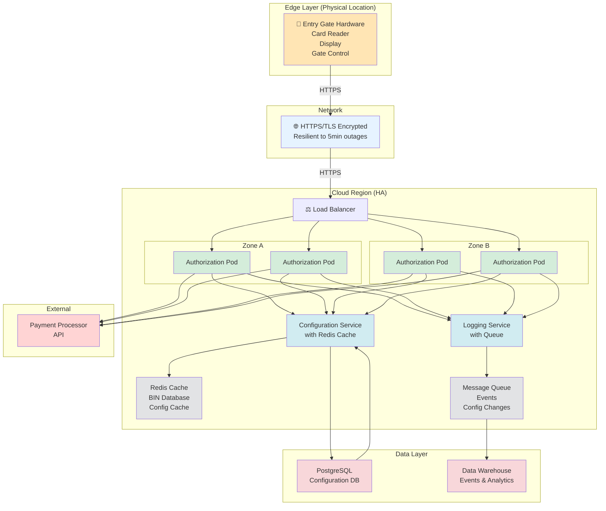

---

## Data Flow: Complete Transaction

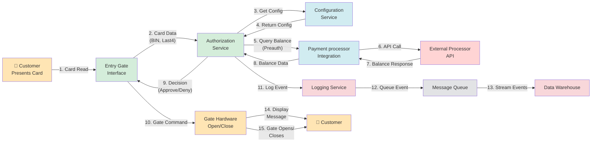

---

## API Contract Overview

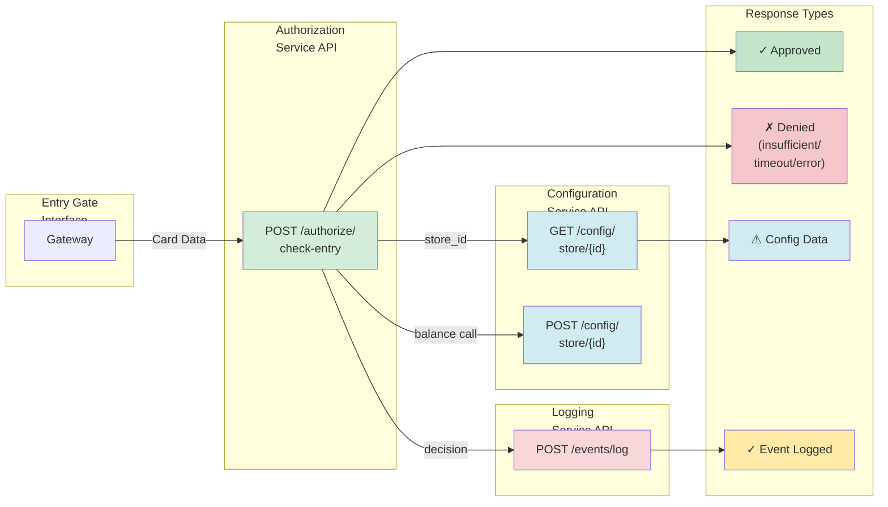

---

## Error Handling Decision Tree

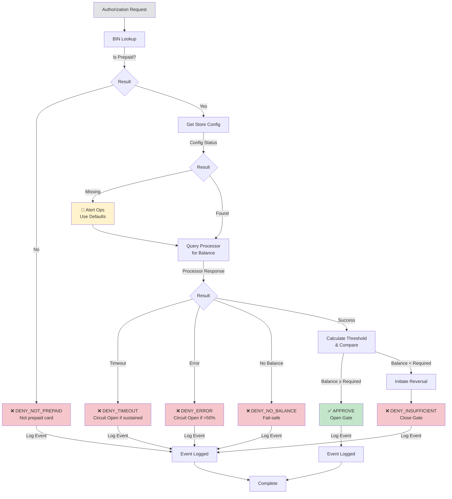

---

## Latency Budget Breakdown

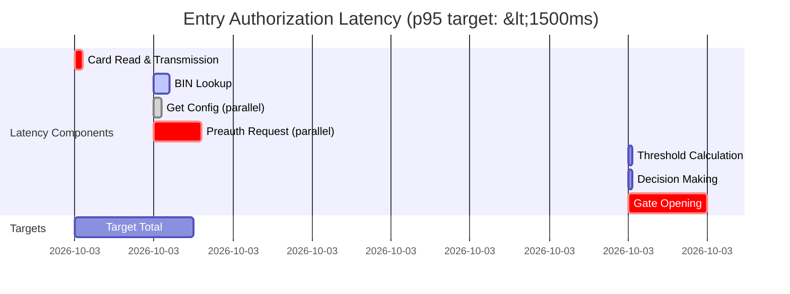

---

## Monitoring & Alerting Strategy

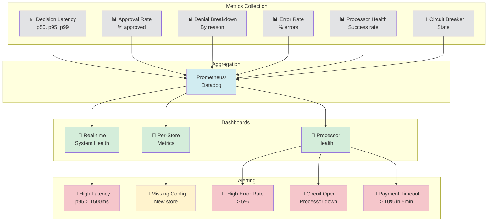

---

**Document Version**: 1.0  
**Last Updated**: March 16, 2026  
**Status**: Complete  
**diagrams**: 11 mermaid diagrams  
**Format**: Markdown + Mermaid (GitHub/VS Code compatible)
