# JWO Prepaid Card Solution - Execution Plan

**Document Status**: APPROVED FOR CONSTRUCTION  
**Phase**: INCEPTION - Workflow Planning  
**Date**: 2026-03-16  

---

## Detailed Analysis Summary

### Transformation Scope

**Transformation Type**: New greenfield payment infrastructure (not a modification to existing system)

**Primary Changes**:
- Create new authorization service for prepaid card validation
- Build payment processing service with multi-processor support
- Implement real-time balance monitoring and alerts
- Create customer payment guarantee management
- Enable partial transaction fulfillment
- Develop mobile app integration points

**New Components Required**:
1. Authorization Service (prepaid card validation + risk scoring)
2. Payment Processing Service (multi-processor routing)
3. Balance Monitoring Service (real-time tracking)
4. Customer Service (guarantee method management)
5. Notification Service (mobile app alerts)
6. Analytics Service (transaction data + reporting)
7. Integration Adapters (JWO entry/exit systems)

**Infrastructure Requirements**:
- API Gateway for authorization endpoints
- Event streaming (for real-time balance updates)
- Data persistence (transaction history, customer profiles)
- Cache layer (card BIN lookups, customer preferences)
- Monitoring and observability

---

### Change Impact Assessment

| Impact Area | Affected | Details |
|---|---|---|
| **User-facing changes** | YES | Mobile app notifications, entry experience altered for prepaid customers |
| **Structural changes** | YES | New microservices architecture with event-driven communication |
| **Data model changes** | YES | New schemas for prepaid transactions, guarantees, balance history |
| **API changes** | YES | New authorization endpoints, hooks into JWO entry/checkout systems |
| **NFR impact** | YES | Real-time processing (<100ms), 99.9% availability, PCI-DSS compliance |

---

### Risk Assessment

**Risk Level**: **MEDIUM**

**Risk Factors**:
- **Complexity**: Multiple payment processors, financial transactions (high complexity)
- **Criticality**: Payment processing is mission-critical
- **Integration Scope**: Full ecosystem integration required
- **Rollback Complexity**: Moderate - can disable prepaid feature without affecting standard flow
- **Unknown Factors**: 
  - Payment processor API quirks
  - Real-world prepaid card behavior patterns
  - Global regulatory variations

**Mitigation Strategy**:
1. MVP with single processor and single location first
2. Comprehensive testing (fraud, edge cases, performance)
3. Graceful degradation (fail-safe to deny entry vs. system crash)
4. Phased rollout (pilot → expansion → global)

---

## Workflow Visualization

```mermaid
flowchart TD
    Start(["User Request: JWO Prepaid Solution"])
    
    subgraph INCEPTION["🔵 INCEPTION PHASE"]
        WD["✅ Workspace Detection<br/><b>COMPLETED</b>"]
        RE["⏭️ Reverse Engineering<br/><b>SKIPPED - Greenfield</b>"]
        RA["✅ Requirements Analysis<br/><b>COMPLETED</b>"]
        US["⏭️ User Stories<br/><b>SKIPPED - Clear Requirements</b>"]
        WP["✅ Workflow Planning<br/><b>COMPLETED</b>"]
        AD["🔄 Application Design<br/><b>EXECUTE</b>"]
        UP["🔄 Units Planning<br/><b>EXECUTE</b>"]
        UG["🔄 Units Generation<br/><b>EXECUTE</b>"]
    end
    
    subgraph CONSTRUCTION["🟢 CONSTRUCTION PHASE"]
        FD["🔄 Functional Design<br/><b>EXECUTE</b>"]
        NFRA["🔄 NFR Requirements<br/><b>EXECUTE</b>"]
        NFRD["🔄 NFR Design<br/><b>EXECUTE</b>"]
        ID["🔄 Infrastructure Design<br/><b>EXECUTE</b>"]
        CP["🔄 Code Planning<br/><b>EXECUTE</b>"]
        CG["🔄 Code Generation<br/><b>EXECUTE</b>"]
        BT["🔄 Build & Test<br/><b>EXECUTE</b>"]
    end
    
    Start --> WD
    WD --> RE
    RE --> RA
    RA --> US
    US --> WP
    WP --> AD
    AD --> UP
    UP --> UG
    UG --> FD
    FD --> NFRA
    NFRA --> NFRD
    NFRD --> ID
    ID --> CP
    CP --> CG
    CG --> BT
    BT --> End(["Solution Ready"])
    
    style WD fill:#4CAF50,stroke:#1B5E20,stroke-width:3px,color:#fff
    style RA fill:#4CAF50,stroke:#1B5E20,stroke-width:3px,color:#fff
    style WP fill:#4CAF50,stroke:#1B5E20,stroke-width:3px,color:#fff
    
    style RE fill:#BDBDBD,stroke:#424242,stroke-width:2px,stroke-dasharray: 5 5,color:#000
    style US fill:#BDBDBD,stroke:#424242,stroke-width:2px,stroke-dasharray: 5 5,color:#000
    
    style AD fill:#FFA726,stroke:#E65100,stroke-width:3px,color:#000
    style UP fill:#FFA726,stroke:#E65100,stroke-width:3px,color:#000
    style UG fill:#FFA726,stroke:#E65100,stroke-width:3px,color:#000
    
    style FD fill:#FFA726,stroke:#E65100,stroke-width:3px,color:#000
    style NFRA fill:#FFA726,stroke:#E65100,stroke-width:3px,color:#000
    style NFRD fill:#FFA726,stroke:#E65100,stroke-width:3px,color:#000
    style ID fill:#FFA726,stroke:#E65100,stroke-width:3px,color:#000
    
    style CP fill:#4CAF50,stroke:#1B5E20,stroke-width:3px,color:#fff
    style CG fill:#4CAF50,stroke:#1B5E20,stroke-width:3px,color:#fff
    style BT fill:#4CAF50,stroke:#1B5E20,stroke-width:3px,color:#fff
    
    style Start fill:#CE93D8,stroke:#6A1B9A,stroke-width:3px,color:#000
    style End fill:#CE93D8,stroke:#6A1B9A,stroke-width:3px,color:#000
    
    linkStyle default stroke:#333,stroke-width:2px
```

**Legend**:
- 🟢 Green: Always-execute phases (completed or required)
- 🟡 Orange: Conditional phases to execute
- ⚫ Gray: Conditional phases skipped
- 🟣 Purple: Start/End

---

## Phases to Execute

### 🔵 INCEPTION PHASE

#### ✅ Workspace Detection - COMPLETED
- **Status**: Done
- **Output**: Greenfield project confirmed
- **Next**: Proceed to Requirements Analysis

#### ⏭️ Reverse Engineering - SKIPPED
- **Reason**: Greenfield project with no existing codebase
- **Rationale**: No legacy systems to analyze

#### ✅ Requirements Analysis - COMPLETED
- **Status**: Done
- **Output**: Comprehensive requirements specification
- **Next**: Proceed to Workflow Planning

#### ⏭️ User Stories - SKIPPED
- **Reason**: Clear, well-defined requirements; single MVP goal
- **Rationale**: 
  - Requirements document provides sufficient detail
  - Fast MVP approach prioritizes speed over elaborate personas
  - Acceptance criteria embedded in requirements
- **Note**: Can add user stories in Phase 2 expansion if needed

#### ✅ Workflow Planning - IN PROGRESS
- **Status**: This document
- **Output**: Execution plan with phase decisions

#### 🔄 Application Design - EXECUTE
- **Rationale**: 
  - New services need architectural definition
  - Component interactions need clarification
  - Service layer design required for multi-processor pattern
- **Scope**:
  - High-level system architecture
  - Service boundaries and responsibilities
  - Data flow between services
  - Component interaction diagrams
  - Technology decision rationale
- **Depth**: Comprehensive (complex payment system)

#### 🔄 Units Planning - EXECUTE
- **Rationale**:
  - Multiple independent services can be developed in parallel
  - Data models need definition before coding
  - API contracts need specification
- **Scope**:
  - Logical grouping of work (Authorization Unit, Payment Processing Unit, etc.)
  - Unit dependencies and interaction points
  - Development priority and sequence
  - Testing strategy per unit
- **Depth**: Standard (clear component boundaries)

#### 🔄 Units Generation - EXECUTE
- **Rationale**:
  - Work needs to be broken into implementations units
  - Each service requires separate design and development
- **Scope**:
  - Detailed unit specifications
  - Data schemas for each unit
  - API specifications (OpenAPI/Swagger)
  - Database/storage requirements
- **Depth**: Comprehensive (financial system requires precision)

### 🟢 CONSTRUCTION PHASE

#### 🔄 Functional Design - EXECUTE
- **Rationale**:
  - Component methods need detailed specification
  - Business logic rules must be documented
  - Authorization and payment processing algorithms need definition
- **Scope per unit**:
  - Authorization Service: Balance query logic, risk scoring algorithm
  - Payment Processing: Multi-processor routing, partial fulfillment logic
  - Balance Monitoring: Real-time update mechanism, alert thresholds
  - Customer Service: Guarantee method validation
- **Depth**: Comprehensive (complex business logic)

#### 🔄 NFR Requirements - EXECUTE
- **Rationale**:
  - Non-functional requirements are critical for this system
  - Performance (<100ms authorization) must be designed for
  - Security (PCI-DSS) requirements need detailed specification
  - Scalability (global deployment) must be architected
- **Key NFRs to Detail**:
  - Real-time performance (latency budgets per service)
  - High availability (failover mechanisms, multi-region)
  - Security (encryption, token management, audit logging)
  - Compliance (PCI-DSS, data retention, audit trails)
  - Scalability (throughput targets, load testing)
  - Observability (monitoring, alerting, dashboards)
- **Depth**: Comprehensive (enterprise payment system)

#### 🔄 NFR Design - EXECUTE
- **Rationale**:
  - NFR implementation requires architectural decisions
  - Performance goals require specific technology choices
  - Security requires specific implementation patterns
  - Scalability requires infrastructure design
- **Scope**:
  - Performance design (caching strategy, async processing)
  - Security design (encryption, token handling, audit logging)
  - Availability design (multi-region, failover, backups)
  - Scalability design (partitioning, load balancing)
  - Monitoring design (metrics, dashboards, alerts)
- **Depth**: Comprehensive

#### 🔄 Infrastructure Design - EXECUTE
- **Rationale**:
  - Building infrastructure from scratch
  - Cloud-agnostic design required
  - Event-driven architecture requires infrastructure decisions
  - Multi-region deployment needs infrastructure planning
- **Scope**:
  - Microservices infrastructure (containers, orchestration)
  - API Gateway configuration
  - Event streaming infrastructure
  - Data persistence (databases, caches)
  - Monitoring and observability
  - Security infrastructure (secrets, IAM, encryption)
  - CI/CD pipeline design
- **Depth**: Comprehensive

#### 🔄 Code Planning - EXECUTE (ALWAYS)
- **Rationale**: Implementation approach needed for each service
- **Scope**:
  - Tech stack per service
  - Framework selection
  - Library selection
  - Project structure
  - Code generation strategy
- **Depth**: Standard

#### 🔄 Code Generation - EXECUTE (ALWAYS)
- **Rationale**: Implement all services according to specifications
- **Scope**:
  - Authorization Service implementation
  - Payment Processing Service implementation
  - Balance Monitoring Service implementation
  - Customer Service implementation
  - Notification Service implementation
  - Analytics Service implementation
  - Integration adapters (JWO entry/exit)
  - Mobile app integration endpoints
- **Depth**: Per-unit (standard for well-designed services)

#### 🔄 Build & Test - EXECUTE (ALWAYS)
- **Rationale**: Build, verify, and test complete solution
- **Scope**:
  - Unit testing (per service)
  - Integration testing (service-to-service)
  - End-to-end testing (full workflow)
  - Performance testing (<100ms requirement)
  - Security testing (PCI-DSS verification)
  - Fraud scenario testing
  - Failover testing (availability verification)
- **Depth**: Comprehensive (critical system)

### 🟡 OPERATIONS PHASE
- **Status**: Placeholder - defer to post-MVP
- **Future Focus**: Deployment, monitoring, operational runbooks

---

## Development Sequence & Parallelization

### Inception Phase Sequence (Sequential)
1. **Application Design** → Define the overall architecture
2. **Units Planning** → Break into units based on architecture
3. **Units Generation** → Generate detailed unit specifications

### Construction Phase Parallelization

**Phase 1: Design (Can execute in parallel by unit)**
- Functional Design (per unit)
- NFR Requirements (per unit from global spec)
- NFR Design (per unit)
- Infrastructure Design (supports all units)

**Phase 2: Implementation (Can parallelize service teams)**
After Infrastructure Design:
- **Team A**: Authorization Service (Functional Design → Code Planning → Code Generation)
- **Team B**: Payment Processing Service (parallel track)
- **Team C**: Balance Monitoring Service (parallel track)
- **Team D**: Supporting Services (Customer, Notification, Analytics - parallel)

**Phase 3: Integration & Test (Sequential)**
1. Per-service Build & Test
2. Integration testing (services together)
3. End-to-end testing (full workflow)
4. Performance testing
5. Security testing

---

## Estimated Timeline

### Phase Duration Estimates (MVP Scope)

| Phase | Duration | Notes |
|---|---|---|
| Application Design | 2-3 days | Architecture, service boundaries, data flow |
| Units Planning | 1 day | Break into development units |
| Units Generation | 2-3 days | Detailed specs, OpenAPI, data schemas |
| Functional Design | 3-5 days | Per-service logic specification |
| NFR Requirements | 1-2 days | Detail requirements created in Requirements phase |
| NFR Design | 2-3 days | Implementation patterns |
| Infrastructure Design | 2-3 days | Cloud-agnostic infrastructure |
| **Code Planning** | 1 day | Tech stack, frameworks, structure |
| **Code Generation** | **2-3 weeks** | Parallel service development |
| **Build & Test** | **1-2 weeks** | Per-service + integration testing |

### Recommended Schedule
- **Week 1**: Inception Phase (Design, Units, Specs) - Sequential
- **Weeks 2-3**: Construction Design (Functional, NFR, Infrastructure) - Parallel where possible
- **Weeks 4-6**: Code Planning & Implementation - Parallel service teams
- **Week 7**: Integration & Testing
- **Week 8**: Performance, Security, Failover Testing + Fixes

**Total MVP Timeline**: 8 weeks (4-6 week target with parallelization)

---

## Success Criteria

### MVP Success Gates
- ✅ **Architecture**: Documented, microservices design approved
- ✅ **Specifications**: OpenAPI specs complete for all services
- ✅ **Code Quality**: Unit tests >80% coverage, no lint errors
- ✅ **Performance**: Authorization <100ms, checkout <500ms
- ✅ **Availability**: 99.9% uptime in staging environment
- ✅ **Security**: PCI-DSS compliance verified
- ✅ **Functionality**: All functional requirements implemented
- ✅ **Documentation**: API docs, deployment guide, runbooks complete

### Phase Success Criteria
- **Inception**: Complete designs, no ambiguity, team consensus
- **Construction Design**: All components designed, NFRs specified
- **Code Implementation**: All code merged, tests passing
- **Integration**: All service-to-service integration verified
- **Testing**: All test scenarios passing
- **Deployment Ready**: Can deploy to production safely

---

## Contingency & Risk Mitigation

### Identified Risks & Mitigations

| Risk | Impact | Mitigation |
|---|---|---|
| Payment processor API delays/issues | HIGH | Early integration work, fallback processor option |
| Real-time performance not achievable | HIGH | Load testing early, cache strategy, async patterns |
| Multi-processor complexity higher than expected | MEDIUM | Focus MVP on single processor, expand Phase 2 |
| PCI-DSS compliance gaps | CRITICAL | Security review at each phase, early compliance audit |
| Team capacity constraints | MEDIUM | Parallelization, phased rollout, clear unit ownership |
| Regulatory/compliance unknowns | MEDIUM | Engage compliance early, document assumptions |

### Contingency Plans
- **If real-time <100ms not achievable**: Fall back to <500ms with improved UX
- **If global deployment too complex**: Focus MVP on single region, expand Phase 2
- **If payment processor unavailable**: Use alternative processor or delay transaction
- **If team falls behind**: Reduce Phase 1 scope, defer Phase 2 features

---

## Next Steps (After Plan Approval)

1. ✅ **Review & Approve Execution Plan** (you are here)
2. 🔄 **Proceed to Application Design Phase** (next)
   - Define system architecture
   - Design service boundaries
   - Create architectural diagrams
   - Specify data flow
3. 🔄 **Units Planning Phase** (after design approval)
4. 🔄 **Units Generation Phase** (detailed specifications)
5. 🟢 **Construction Phase Begin** (Design → Implementation)

---

